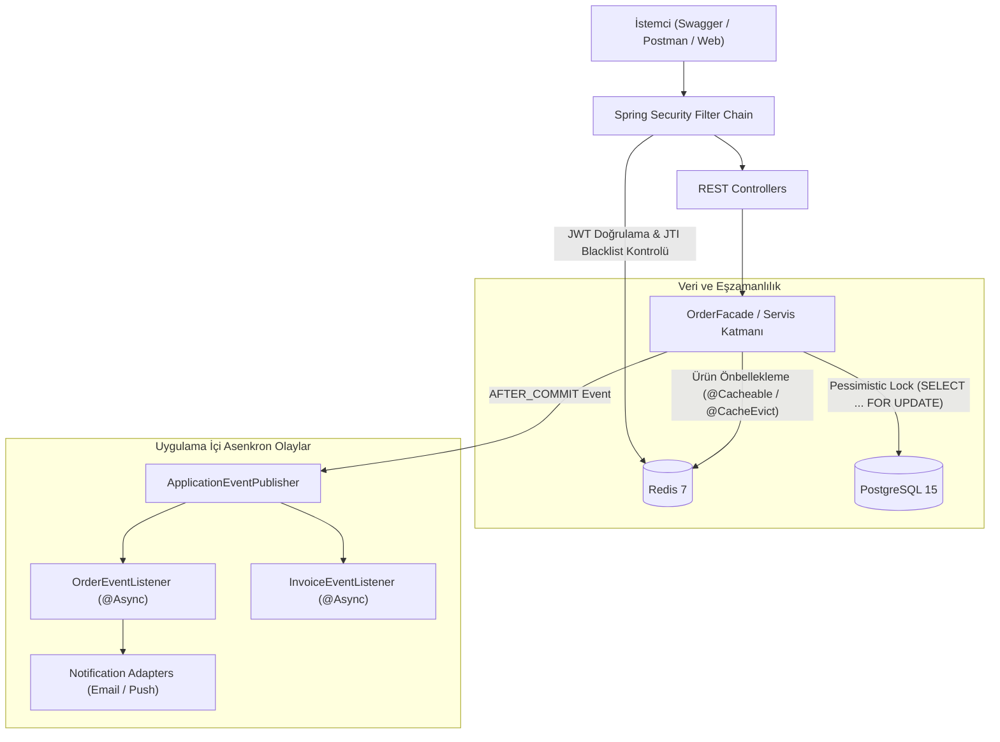

# 🛒 Mini E-Commerce REST API


## 📋 Proje Özeti
Bu proje; **Java 21** ve **Spring Boot 3** kullanılarak geliştirilmiş, **PostgreSQL** ve **Redis** altyapılarına dayanan bir e-ticaret arka yüz (backend) REST API uygulamasıdır. Sistem; eşzamanlı stok yönetimi, sipariş yaşam döngüsü, JWT tabanlı kimlik doğrulama, Redis önbellek/oturum yönetimi ve yazılım tasarım desenlerinin uygulanmasını sergilemek amacıyla hazırlanmıştır.

---

## 📑 İçindekiler
1. [Teknolojik Altyapı (Tech Stack)](#-teknolojik-altyap%C4%B1-tech-stack)
2. [Proje Dizin Yapısı](#-proje-dizin-yap%C4%B1s%C4%B1)
3. [Mimari Yaklaşım ve Tasarım Desenleri](#-mimari-yakla%C5%9F%C4%B1m-ve-tasar%C4%B1m-desenleri)
4. [Eşzamanlı Stok Yönetimi (Pessimistic Locking)](#-e%C5%9Fzamanl%C4%B1-stok-y%C3%B6netimi-pessimistic-locking)
5. [Uygulama İçi Asenkron Olaylar (Application Events)](#-uygulama-%C4%B0%C3%A7i-asenkron-olaylar-application-events)
6. [Redis Kullanım Alanları](#-redis-kullan%C4%B1m-alanlar%C4%B1)
7. [Güvenlik ve Kimlik Doğrulama (Security & JWT)](#-g%C3%BCvenlik-ve-kimlik-do%C4%9Frulama-security--jwt)
8. [Hata Yönetimi (Error Handling)](#-hata-y%C3%B6netimi-error-handling)
9. [Veritabanı Modeli](#-veritaban%C4%B1-modeli)
10. [REST API Uç Noktaları](#-rest-api-u%C3%A7-noktalar%C4%B1)
11. [Test Stratejisi ve Doğrulama](#-test-stratejisi-ve-do%C4%9Frulama)
12. [Gözlemlenebilirlik (Prometheus, Loki, Grafana)](#-g%C3%B6zlemlenebilirlik-prometheus-loki-grafana)
13. [Kurulum ve Çalıştırma Kılavuzu](#-kurulum-ve-%C3%87al%C4%B1%C5%9Ft%C4%B1rma-k%C4%B1lavuzu)

---

## 🚀 Teknolojik Altyapı (Tech Stack)

| Bileşen | Versiyon / Kütüphane | Kullanım Alanı |
| :--- | :--- | :--- |
| **Dil** | Java 21 (LTS) | Modern Java özellikleri (Record, Pattern Matching, Switch Expressions) |
| **Çatı** | Spring Boot 3.4.x | Web MVC, Data JPA, Security, Cache, Async altyapısı |
| **Veritabanı** | PostgreSQL 15+ | İlişkisel veri saklama, transactional işlemler ve satır bazlı kilitler |
| **Önbellek & Store** | Redis 7+ | Ürün önbellekleme, JWT blacklist, refresh token saklama ve rate limiting |
| **Güvenlik** | Spring Security & JJWT 0.12.x | Stateless JWT doğrulama, Rol Bazlı Yetkilendirme (RBAC) |
| **Gözlemlenebilirlik** | Prometheus, Loki, Grafana | Metrik toplama (Micrometer/Actuator), log akışı (Loki4j) ve dashboard izleme |
| **Model Dönüşümü** | MapStruct 1.6.x | Derleme zamanı (compile-time) DTO-Entity eşleme |
| **Dokümantasyon** | Springdoc OpenAPI 2.8.x | Swagger UI ve OpenAPI 3.0 dokümantasyonu |
| **Konteynerleme** | Docker & Docker Compose | 5 servisli izole ortam (PostgreSQL, Redis, Loki, Prometheus, Grafana) |
| **Test** | JUnit 5 & Mockito | Servis ve iş kuralı birim testleri |

---

## 📂 Proje Dizin Yapısı

Proje; katmanlı mimari ve sorumlulukların ayrılığı (*Separation of Concerns*) prensiplerine göre yapılandırılmıştır:

```
ecommerce/
├── docker-compose.yml                     # PostgreSQL (5433:5432) ve Redis (6379) servis tanımları
├── pom.xml                                # Maven bağımlılıkları ve derleme yapılandırması
├── scripts/
│   └── run_api_tests.ps1                  # Uçtan uca API doğrulama ve test betiği
└── src/
    ├── main/
    │   ├── java/com/ecommerce/
    │   │   ├── EcommerceApplication.java  # Başlangıç sınıfı (@EnableAsync, @EnableCaching)
    │   │   ├── config/                    # Altyapı ve kütüphane konfigürasyonları
    │   │   │   ├── AsyncConfig.java       # ThreadPoolTaskExecutor asenkron havuz ayarları
    │   │   │   ├── CacheConfig.java       # RedisCacheManager ve TTL yapılandırması
    │   │   │   ├── DataInitializer.java   # Başlangıç admin kullanıcısı tohumlama (CommandLineRunner)
    │   │   │   ├── OpenApiConfig.java     # Swagger / OpenAPI 3.0 JWT Bearer yapılandırması
    │   │   │   ├── RedisConfig.java       # RedisConnectionFactory ve RedisTemplate tanımları
    │   │   │   └── SecurityConfig.java    # SecurityFilterChain, RBAC ve yetkilendirme kuralları
    │   │   ├── controller/                # REST Controller katmanı
    │   │   │   ├── AdminOrderController.java
    │   │   │   ├── AuthController.java
    │   │   │   ├── CategoryController.java
    │   │   │   ├── OrderController.java
    │   │   │   └── ProductController.java
    │   │   ├── dto/                       # Veri transfer nesneleri (Request / Response)
    │   │   ├── entity/                    # JPA Varlık sınıfları
    │   │   ├── enums/                     # OrderStatus, Role enum tanımları
    │   │   ├── event/                     # Uygulama içi domain event sınıfları ve dinleyiciler
    │   │   │   ├── InvoiceEventListener.java
    │   │   │   ├── OrderEventListener.java
    │   │   │   ├── OrderPlacedEvent.java
    │   │   │   └── OrderStatusChangedEvent.java
    │   │   ├── exception/                 # Merkezi hata yakalama ve özel exception sınıfları
    │   │   ├── facade/                    # Sipariş oluşturma orkestrasyonu (OrderFacade)
    │   │   ├── mapper/                    # MapStruct arayüzleri
    │   │   ├── pattern/                   # Tasarım desenleri
    │   │   │   ├── adapter/               # NotificationSender ve simüle edilmiş istemciler
    │   │   │   └── strategy/              # DiscountStrategy uygulamaları ve Factory
    │   │   ├── redis/                     # Redis işlem servisleri (Cache, Token, RateLimit)
    │   │   ├── repository/                # Spring Data JPA Repository arayüzleri
    │   │   ├── security/                  # JWT filtreleri, UserDetailsService ve TokenProvider
    │   │   └── service/                   # İş mantığı servisleri
    │   └── resources/
    │       └── application.yml            # Veritabanı, Redis ve uygulama ayarları
    └── test/java/com/ecommerce/
        ├── pattern/strategy/
        │   └── PercentageDiscountStrategyTest.java  # İndirim stratejisi birim testleri
        └── service/
            └── CategoryServiceTest.java             # Mockito ile izole edilmiş servis testleri
```

---

## 🏛️ Mimari Yaklaşım ve Tasarım Desenleri

### Sistem Mimarisi ve Akış Şeması


### Uygulanan Tasarım Desenleri
Projede nesne yönelimli tasarım ve SOLID prensiplerinden yararlanılarak belirli tasarım desenleri uygulanmıştır:

### 1. Facade Pattern (`OrderFacade`)
Sipariş verme süreci birden fazla alt sistemle etkileşim kurar (ürün kilitleme, stok güncelleme, indirim hesaplama, sipariş kaydı ve asenkron event tetikleme). `OrderFacade`, bu akışı tek bir arayüz arkasında toplayarak controller katmanının yalnızca tek bir servis ile iletişim kurmasını sağlar.

### 2. Strategy Pattern (`DiscountStrategy`)
Farklı indirim hesaplama yöntemleri (`PercentageDiscountStrategy`, `FixedAmountDiscountStrategy`, `NoDiscountStrategy`) ortak bir arayüz arkasında uygulanmıştır. Bu sayede yeni bir indirim kuralı eklendiğinde mevcut kod değiştirilmeden sisteme dahil edilebilir (Open/Closed prensibi).

### 3. Factory Pattern (`DiscountStrategyFactory`)
Konfigürasyondan veya istekten gelen indirim tipine göre ilgili `DiscountStrategy` nesnesini çalışma zamanında (runtime) üretir.

### 4. Adapter Pattern (`EmailNotificationAdapter`, `PushNotificationAdapter`)
Uygulama içi bildirimleri soyutlayan `NotificationSender` arayüzü ile harici bildirim formatları arasında bir uyarlama sağlar.
> **Not:** `FakeEmailClient` ve `FakePushClient` sınıfları gerçek bir üçüncü parti entegrasyonu içermez; Adapter tasarım desenini sergilemek amacıyla simüle edilmiş yapılardır.

### ⚖️ Mimari Kararlar ve Tercih Gerekçeleri

| Mimari Karar | Tercih Edilen Çözüm | Alternatif | Tercih Gerekçesi |
| :--- | :--- | :--- | :--- |
| **Eşzamanlı Stok Kontrolü** | Pessimistic Lock (`PESSIMISTIC_WRITE`) | Optimistic Lock (`@Version`) | Yüksek çekişmeli (*high contention*) stok senaryolarında versiyon çakışması ve rollback/retry maliyetini önlemek. |
| **Oturum ve Token İptali** | Redis Blacklist (`jti` TTL) | Veritabanı Session Tablosu | Her istekte ilişkisel veritabanına sorgu atmayıp JWT'nin stateless doğasını korurken güvenli logout sağlamak. |
| **Yan Etki Ayrıştırması** | Spring Application Events (`AFTER_COMMIT`) | Senkron Metot Çağrısı | Bildirim ve fatura gibi ikincil süreçlerin ana sipariş transaction'ını ve veritabanı kilit süresini uzatmasını önlemek. |
| **Süreç İçi Asenkronluk** | `ThreadPoolTaskExecutor` + Spring Events | Dağıtık Broker (Kafka/RabbitMQ) | Tekil servis (*monolit*) mimarisinde harici altyapı bağımlılığı ve operasyonel karmaşıklık getirmeden yan etkileri thread seviyesinde izole etmek. |
| **Fiyatlandırma & İndirim** | Strategy + Factory Pattern | Çoklu `if-else` / `switch` | Yeni indirim kuralları eklendiğinde mevcut kod bloklarını değiştirmeden genişletilebilirlik (*Open/Closed Prensibi*) sağlamak. |

---

## 🔒 Eşzamanlı Stok Yönetimi (Pessimistic Locking)

E-ticaret sistemlerinde aynı ürüne birden fazla kullanıcının aynı anda sipariş vermesi durumunda stok tutarsızlıkları (race condition) meydana gelebilir.

Bu projede stok yönetimi için veritabanı seviyesinde **Pessimistic Write Lock (`PESSIMISTIC_WRITE`)** tercih edilmiştir:

```java
// ProductRepository.java
@Lock(LockModeType.PESSIMISTIC_WRITE)
@Query("SELECT p FROM Product p WHERE p.id = :id")
Optional<Product> findByIdWithLock(@Param("id") Long id);
```

### Akış:
1. `OrderFacade`, sipariş oluşturulurken ilgili ürün satırını `SELECT ... FOR UPDATE` sorgusuyla kilitler.
2. Diğer eşzamanlı transaction'lar, bu ürünün kilidi açılana kadar (transaction commit veya rollback olana kadar) bekletilir.
3. Ürünün mevcut stoğu kontrol edilir. Stok yetersizse `InsufficientStockException` fırlatılır ve transaction geri alınır (*rollback*).
4. Stok yeterliyse stok miktarı düşülür, sipariş kaydedilir ve transaction commit edilerek kilit serbest bırakılır.

Transaction ve row-level pessimistic locking ile aynı ürün üzerinde yarışan siparişlerin kontrol edilmesi ve stok tutarlılığının korunması hedeflenmiştir.

---

## 📡 Uygulama İçi Asenkron Olaylar (Application Events)

Sipariş işlemi tamamlandığında yapılması gereken ikincil işlemler (bildirim gönderme, fatura kaydı vb.), ana sipariş transaction'ını yavaşlatmamak adına ayrıştırılmıştır.

> **Önemli Not:** Bu implementasyon Kafka veya RabbitMQ gibi harici bir dağıtık message broker kullanmaz; event'ler uygulama süreci (*in-process*) içerisinde Spring'in `ApplicationEventPublisher`, `@TransactionalEventListener` ve `@Async` mekanizmalarıyla asenkron olarak işlenir.

```
[Müşteri İsteği] 
       │
       ▼
[OrderFacade.createOrder()] ─── (Ana Transaction) ───► Sipariş DB'ye Yazılır
       │
       ▼
ApplicationEventPublisher.publishEvent(OrderPlacedEvent)
       │
       ├─► Transaction COMMIT Edilir (Kilitler ve DB bağlantısı serbest bırakılır)
       │
       ▼
@TransactionalEventListener(phase = TransactionPhase.AFTER_COMMIT) + @Async
       │
       ├─► OrderEventListener    ──► Bildirim gönderimi (Simüle adapter)
       └─► InvoiceEventListener  ──► Örnek fatura kaydı (Simüle işlem)
```

Bu yapı ile ana transaction yalnızca sipariş ve stok işlemlerini kapsar; bildirim ve fatura gibi yan etkiler ise ana transaction başarıyla commit edildikten sonra ayrı thread havuzunda (`ThreadPoolTaskExecutor`) asenkron olarak yürütülür.

---

## ⚡ Redis Kullanım Alanları

Redis, uygulama seviyesinde dört farklı mekanizma için yapılandırılmıştır:

1. **Ürün Kataloğu Önbelleği (Product Cache):**
   * Ürün detay sorgularında veritabanı yükünü azaltmak amacıyla `@Cacheable(value = "products", key = "#id")` kullanılır.
   * Ürün güncellendiğinde veya silindiğinde `@CacheEvict` ile ilgili önbellek kaydı temizlenir (*cache invalidation*).
2. **JWT Kara Listesi (Token Blacklist):**
   * Kullanıcı çıkış yaptığında (*logout*), mevcut Access Token'ın benzersiz kimliği (`jti`), token'ın kalan geçerlilik süresi kadar TTL atanarak Redis'e kaydedilir.
   * `JwtAuthenticationFilter`, gelen her istekte token ID'sinin bu listede olup olmadığını kontrol eder.
3. **Refresh Token Deposu:**
   * Uzun ömürlü refresh token'lar kullanıcı ID'si anahtarıyla (`refresh_token:{userId}`) Redis'te saklanır.
   * Oturum sonlandırıldığında bu kayıt silinir.
4. **Hız Sınırlama (Rate Limiting):**
   * Başarısız giriş denemelerine karşı istemci IP adresi bazlı bir sayaç tutulur (`failed_attempts:{ip}`).
   * Belirli bir hata eşiği aşıldığında geçici süreyle yeni istekler engellenir (`RateLimitException`).

---

## 🛡️ Güvenlik ve Kimlik Doğrulama (Security & JWT)

Uygulama, **Spring Security** ve **JJWT** kullanılarak durum bilgisi tutmayan (*stateless*) bir yapıda korunmaktadır:

* **Access Token:** Kısa ömürlü (15 dakika) olup API isteklerinin doğrulanmasında kullanılır.
* **Refresh Token:** Uzun ömürlü (7 gün) olup süresi dolan access token'ı yenilemek için kullanılır.
* **Refresh Token Yenileme (Rotation):** Kullanıcı yeni bir token çifti talep ettiğinde (`/api/auth/refresh`), geçerli refresh token doğrulanır; ardından hem yeni bir access token hem de yeni bir refresh token üretilerek eskisi Redis üzerinde güncellenir.
* **Rol Bazlı Erişim (RBAC):**
  * `CUSTOMER`: Kendi siparişlerini oluşturma, listeleme ve iptal etme yetkilerine sahiptir.
  * `ADMIN`: Ürün/kategori CRUD işlemleri ve sistemdeki tüm siparişlerin durumunu güncelleme yetkilerine sahiptir.

---

## ⚠️ Hata Yönetimi (Error Handling)

Tüm runtime ve validasyon hataları `@RestControllerAdvice` ile [GlobalExceptionHandler](file:///c:/Users/Yakup%20Y%C4%B1lmaz/Desktop/yeniproje/ecommerce/src/main/java/com/ecommerce/exception/GlobalExceptionHandler.java) sınıfında merkezi olarak yakalanır ve **standartlaştırılmış JSON hata formatı** ile istemciye döndürülür:

```json
{
  "status": 400,
  "error": "Bad Request",
  "message": "Ürün için yeterli stok bulunmamaktadır.",
  "timestamp": "2026-10-06T14:00:00",
  "validationErrors": null
}
```

---

## 🗄️ Veritabanı Modeli

Sistem ilişkisel olarak şu temel tablolardan oluşur:
* `users`: Müşteri ve yönetici kullanıcı bilgileri, roller ve şifre hash'leri.
* `categories`: Ürün kategorileri.
* `products`: Ürün kataloğu, fiyat ve stok bilgileri.
* `orders`: Sipariş ana bilgileri, toplam tutar, sipariş durumu ve kullanıcı ilişkisi.
* `order_items`: Siparişe ait kalemler, adet bilgisi ve sipariş anındaki birim fiyat.

`Order` ve `OrderItem` arasında çift yönlü ilişki tanımlanmış olup (`OneToMany` / `ManyToOne`), yaşam döngüsü `CascadeType.ALL` ve `orphanRemoval = true` ile yönetilmektedir.

---

## 🔌 REST API Uç Noktaları

### 🔐 Kimlik Doğrulama (`/api/auth`)
| Metot | Uç Nokta | Yetki | Açıklama |
| :--- | :--- | :---: | :--- |
| `POST` | `/api/auth/register` | Herkese Açık | Yeni müşteri kaydı oluşturur |
| `POST` | `/api/auth/login` | Herkese Açık | Giriş yapar; access ve refresh token döner |
| `POST` | `/api/auth/refresh` | Herkese Açık | Refresh token ile yeni token çifti üretir |
| `POST` | `/api/auth/logout` | Giriş Yapmış | Token'ı kara listeye alır ve oturumu kapatır |

### 📦 Ürün Kataloğu (`/api/products`)
| Metot | Uç Nokta | Yetki | Açıklama |
| :--- | :--- | :---: | :--- |
| `GET` | `/api/products` | Herkese Açık | Sayfalamalı ve filtreli ürün listesi |
| `GET` | `/api/products/{id}` | Herkese Açık | Ürün detayı (Redis Cache destekli) |
| `POST` | `/api/products` | **ADMIN** | Yeni ürün ekler |
| `PUT` | `/api/products/{id}` | **ADMIN** | Ürünü günceller ve ilgili cache'i temizler |
| `DELETE`| `/api/products/{id}` | **ADMIN** | Ürünü siler ve cache'i temizler |

### 🏷️ Kategori Yönetimi (`/api/categories`)
| Metot | Uç Nokta | Yetki | Açıklama |
| :--- | :--- | :---: | :--- |
| `GET` | `/api/categories` | Herkese Açık | Kategorileri listeler |
| `GET` | `/api/categories/{id}` | Herkese Açık | Kategori detayı getirir |
| `POST` | `/api/categories` | **ADMIN** | Yeni kategori oluşturur |
| `PUT` | `/api/categories/{id}` | **ADMIN** | Kategori bilgilerini günceller |
| `DELETE`| `/api/categories/{id}` | **ADMIN** | Kategoriyi siler |

### 🛍️ Müşteri Siparişleri (`/api/orders`)
| Metot | Uç Nokta | Yetki | Açıklama |
| :--- | :--- | :---: | :--- |
| `POST` | `/api/orders` | **CUSTOMER** | Kilitli stok kontrolüyle sipariş oluşturur |
| `GET` | `/api/orders` | **CUSTOMER** | Giriş yapmış kullanıcının geçmiş siparişleri |
| `GET` | `/api/orders/{id}` | **CUSTOMER** | Kullanıcının sipariş detayı |
| `PUT` | `/api/orders/{id}/cancel` | **CUSTOMER** | Bekleyen siparişi iptal eder ve stoğu iade eder |

### 👑 Yönetici Sipariş Yönetimi (`/api/admin/orders`)
| Metot | Uç Nokta | Yetki | Açıklama |
| :--- | :--- | :---: | :--- |
| `GET` | `/api/admin/orders` | **ADMIN** | Sistemdeki tüm siparişleri listeler |
| `PUT` | `/api/admin/orders/{id}/status` | **ADMIN** | Sipariş durumunu günceller (`CONFIRMED`, `SHIPPED` vb.) |

---

## 🧪 Test Stratejisi ve Doğrulama

### 1. Birim (Unit) Testler (`JUnit 5 & Mockito`)
İş kuralları ve servis metodları dış bağımlılıklardan (veritabanı veya Redis) izole edilerek test edilmiştir:
* `PercentageDiscountStrategyTest`: İndirim hesaplama kuralları, geçersiz parametreler, sıfır/negatif tutarlar ve sınır durumları.
* `CategoryServiceTest`: Mockito ile repository çağrılarının doğrulanması, bulunamayan kayıtlarda `ResourceNotFoundException` ve mükerrer kayıtlarda `AlreadyExistsException` fırlatılma durumları.

Çalıştırma komutu:
```bash
mvn test
```

### 2. Canlı API Doğrulama Betiği (`scripts/run_api_tests.ps1`)
Sistem ayağa kalktığında uç noktaların, yetkilendirme kurallarının ve Redis entegrasyonunun canlı ortamda doğrulanması için otomatik bir test betiği bulunmaktadır.

*Dosya konumu:* [`scripts/run_api_tests.ps1`](file:///c:/Users/Yakup%20Y%C4%B1lmaz/Desktop/yeniproje/ecommerce/scripts/run_api_tests.ps1)

```powershell
powershell -ExecutionPolicy Bypass -File .\scripts\run_api_tests.ps1
```

> **Not:** Aşağıdaki çıktı, yerel geliştirme ortamındaki test senaryolarının doğrulandığı örnek bir çalıştırma sonucudur:

```text
================================================================================
            E-COMMERCE API AUTOMATED ENDPOINT VERIFICATION
================================================================================

>>> [1/7] Testing Authentication (Register, Login, Refresh, Admin Role)...
  [OK] (201) POST /api/auth/register - Register Customer User
  [OK] (200) POST /api/auth/login - Login Admin User
  [OK] (200) POST /api/auth/login - Login Customer User
  [OK] (200) POST /api/auth/refresh - Refresh Token for Customer

>>> [2/7] Testing Category Endpoints...
  [OK] (200) GET /api/categories - Public GET /api/categories
  [OK] (201) POST /api/categories - Admin POST /api/categories
  [OK] (200) GET /api/categories/{id} - Public GET /api/categories/{id}
  [OK] (200) PUT /api/categories/{id} - Admin PUT /api/categories/{id}
  [OK] (204) DELETE /api/categories/{id} - Admin DELETE /api/categories/{id}

>>> [3/7] Testing Product Endpoints...
  [OK] (201) POST /api/products - Admin POST /api/products
  [OK] (200) GET /api/products - Public GET /api/products (Pageable)
  [OK] (200) GET /api/products/{id} - Public GET (Cache Miss -> DB)
  [OK] (200) GET /api/products/{id} - Public GET (Cache Hit)
  [OK] (200) PUT /api/products/{id} - Admin PUT /api/products/{id}
  [OK] (204) DELETE /api/products/{id} - Admin DELETE /api/products/{id}

>>> [4/7] Testing Customer Orders (Pessimistic Lock, Stock, Discount)...
  [OK] (201) POST /api/orders - Customer POST /api/orders (Place Order)
  [OK] (200) GET /api/orders - Customer GET /api/orders
  [OK] (200) GET /api/orders/{id} - Customer GET /api/orders/{id}
  [OK] (200) PUT /api/orders/{id}/cancel - Customer PUT /api/orders/{id}/cancel

>>> [5/7] Testing Admin Order Management Endpoints...
  [OK] (200) GET /api/admin/orders - Admin GET /api/admin/orders
  [OK] (200) PUT /api/admin/orders/{id}/status - Admin PUT (Status Update)

>>> [6/7] Testing Security & RBAC Constraints...
  [OK] (403) POST /api/categories - RBAC: Customer accessing Admin Category (Expected: 403)
  [OK] (403) GET /api/admin/orders - RBAC: Customer accessing Admin Orders (Expected: 403)
  [OK] (401) POST /api/orders - RBAC: Anonymous accessing Order creation (Expected: 401)

>>> [7/7] Testing Logout & Redis Token Blacklist...
  [OK] (204) POST /api/auth/logout - Customer POST (Blacklists token in Redis)
  [OK] (401) GET /api/orders - Security: Reusing Logged-Out Token (Expected: 401)

================================================================================
 Total Endpoints Tested : 32
 Passed                 : 32
 Failed                 : 0
================================================================================
```

---

## 📊 Gözlemlenebilirlik (Prometheus, Loki, Grafana)

Uygulamanın çalışma zamanındaki sağlık durumu, performans metrikleri ve logları izlemek amacıyla Docker Compose üzerinden hafif ve entegre bir gözlemlenebilirlik (*observability*) altyapısı sunulmaktadır.

```
[ Spring Boot API (:8080) ]
       │
       ├─► (HTTP /actuator/prometheus) ──► [ Prometheus (:9090) ] ──┐
       │                                                             ├──► [ Grafana (:3000) ]
       └─► (Loki4j Log Streaming)     ──► [ Loki (:3100) ]       ──┘
```

### 1. Prometheus Metrikleri (Port 9090)
* Spring Boot Actuator ve Micrometer Prometheus Registry kullanılarak JVM bellek kullanımı, CPU yükü, HTTP istek sayıları ve yanıt süreleri dışa aktarılır (`/actuator/prometheus`).
* Prometheus konteyneri, her 5 saniyede bir uygulamayı sorgulayarak (*scrape*) metrikleri zaman serisi olarak toplar.
* **Arayüz:** [http://localhost:9090](http://localhost:9090)

### 2. Loki ile Merkezi Loglama (Port 3100)
* `logback-spring.xml` içinde yapılandırılan `Loki4jAppender` aracılığıyla uygulama logları asenkron olarak doğrudan Loki'ye aktarılır.
* Harici ağır bir aracı sürece gerek kalmaksızın etiketli (*label: app=ecommerce, level=INFO*) formatta depolanır.

### 3. Grafana Dashboard (Port 3000)
* Prometheus ve Loki veri kaynakları (*datasources*), konteyner ayağa kalktığında otomatik olarak tanımlanır (*auto-provisioning*).
* **Arayüz:** [http://localhost:3000](http://localhost:3000)
* **Giriş Bilgileri:** `admin` / `admin`
* **Log Takibi:** Grafana arayüzünde **Explore** sekmesinden `Loki` seçilip `{app="ecommerce"}` sorgusu çalıştırılarak tüm loglar canlı (*Live*) veya geçmişe dönük incelenebilir.
* **Kritik Metriklerin Takibi:** (Sektör standartlarında uygulamanın önemli kabul edilen aşağıdaki metrikler Prometheus üzerinden anlık takip edilmektedir):
  1. **RAM/Bellek Tüketimi ve Memory Leak Kontrolü:** `jvm_memory_used_bytes{area="heap"}` (Garbage Collector'ın sağlıklı çalışıp çalışmadığını gösterir).
  2. **Veritabanı Connection Pool (HikariCP) Yoğunluğu:** `hikaricp_connections_active` (Pessimistic Lock gibi işlemlerde aktif/bekleyen bağlantıların şişip şişmediğini gösterir).
  3. **İşlemci (CPU) Darboğazı:** `process_cpu_usage` (Şifreleme (Bcrypt) gibi ağır işlemlerin sunucuyu ne kadar yorduğunu gösterir).
  4. **Anlık Ağ Trafiği (TPS):** `rate(http_server_requests_seconds_count[1m])` (Uygulamanın o an ne kadar yoğun istek aldığını belirtir).

---

## 🛠️ Kurulum ve Çalıştırma Kılavuzu

### Gereksinimler
* **Java 21 (JDK)**
* **Maven 3.9+**
* **Docker & Docker Compose**

### 1. Servis Konteynerlerini Başlatma
Docker Compose ile 5 servis tek komutla ayağa kaldırılır (PostgreSQL `5433`, Redis `6379`, Loki `3100`, Prometheus `9090`, Grafana `3000`):

```bash
docker compose up -d
```

### 2. Uygulamayı Derleme ve Çalıştırma
```bash
# Projeyi derle:
mvn clean compile

# Birim testleri çalıştır:
mvn test

# Spring Boot uygulamasını başlat:
mvn spring-boot:run
```

Uygulama varsayılan olarak `http://localhost:8080` portunda çalışacaktır.

### 3. Başlangıç Kullanıcı Bilgisi (Seed Admin)
Uygulama ilk kez ayağa kalktığında, `DataInitializer` bileşeni tarafından sistem yöneticisi kullanıcısı oluşturulur:
* **E-Posta:** `admin@ecommerce.com`
* **Şifre:** `AdminPassword123*`
* **Rol:** `ROLE_ADMIN`

> ⚠️ **Güvenlik Uyarısı:** Bu bilgiler yerel geliştirme ve demo amaçlıdır. Production ortamında varsayılan hesap kullanılmamalı; şifreler ve gizli anahtarlar ortam değişkenleri (*environment variables*) üzerinden yönetilmelidir.

### 4. Swagger UI & API Dokümantasyonu
Uygulama çalışırken tarayıcınızdan interaktif API dokümantasyonuna erişebilirsiniz:
* **Swagger UI:** [http://localhost:8080/swagger-ui/index.html](http://localhost:8080/swagger-ui/index.html)
* **OpenAPI Şeması:** [http://localhost:8080/api-docs](http://localhost:8080/api-docs)

Korumalı uç noktaları test etmek için `POST /api/auth/login` üzerinden alınan JWT token'ı arayüzdeki **Authorize** bölümüne `Bearer <token>` formatında ekleyebilirsiniz.
